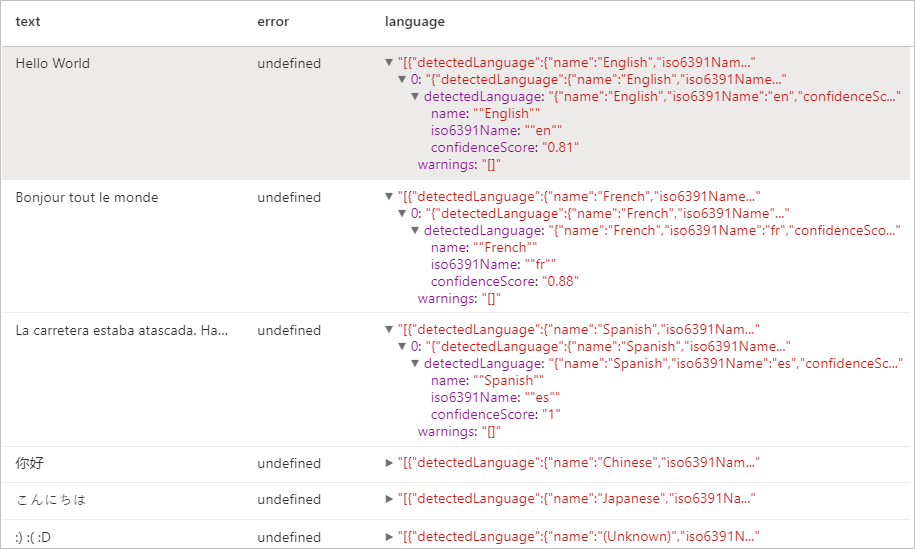

Sentimento do texto
A Análise de Sentimento do Texto permite detectar os rótulos de sentimento (como "negativo", "neutro" e "positivo") e pontuações de confiança no nível da frase e do documento. 

# Create a dataframe that's tied to it's column names
df = spark.createDataFrame([
  ("I am so happy today, its sunny!", "en-US"),
  ("I am frustrated by this rush hour traffic", "en-US"),
  ("The Azure AI services on spark aint bad", "en-US"),
], ["text", "language"])

# Run the Text Analytics service with options
sentiment = (TextSentiment()
    .setLinkedService(linked_service_name)
    .setTextCol("text")
    .setOutputCol("sentiment")
    .setErrorCol("error")
    .setLanguageCol("language"))

# Show the results of your text query in a table format
results = sentiment.transform(df)

display(results
    .withColumn("sentiment", col("sentiment").getItem("document").getItem("sentences")[0].getItem("sentiment"))
    .select("text", "sentiment"))

    # text	      #sentimento
- Estou tão feliz hoje, está ensolarado!	             ## positivo
- Estou frustrado com esse trânsito da horas do rush	 ## negativo
- Os serviços de IA do Azure no Spark funcionam bem	     ## positivo

# Detector de Idioma

# Create a dataframe that's tied to it's column names
df = spark.createDataFrame([
  ("Hello World",),
  ("Bonjour tout le monde",),
  ("La carretera estaba atascada. Había mucho tráfico el día de ayer.",),
  ("你好",),
  ("こんにちは",),
  (":) :( :D",)
], ["text",])

# Run the Text Analytics service with options
language = (LanguageDetector()
    .setLinkedService(linked_service_name)
    .setTextCol("text")
    .setOutputCol("language")
    .setErrorCol("error"))

# Show the results of your text query in a table format
display(language.transform(df))

